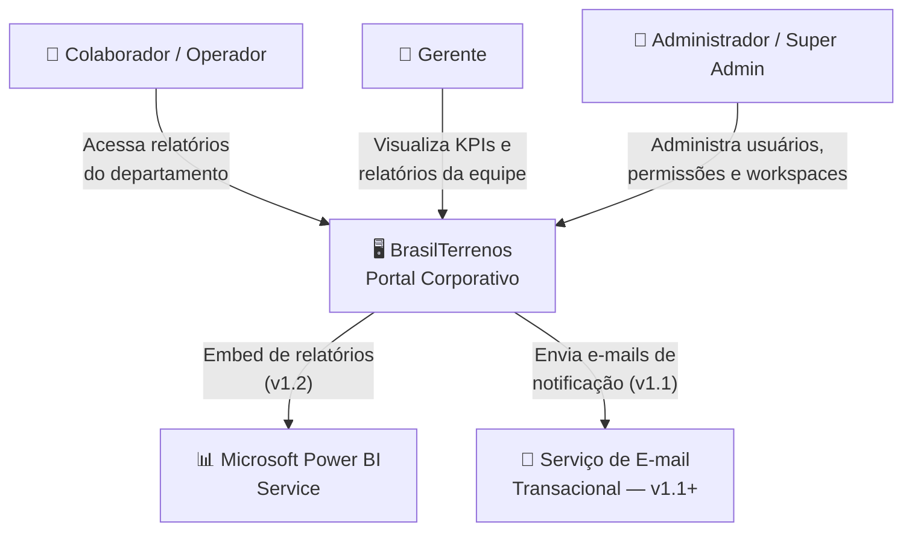
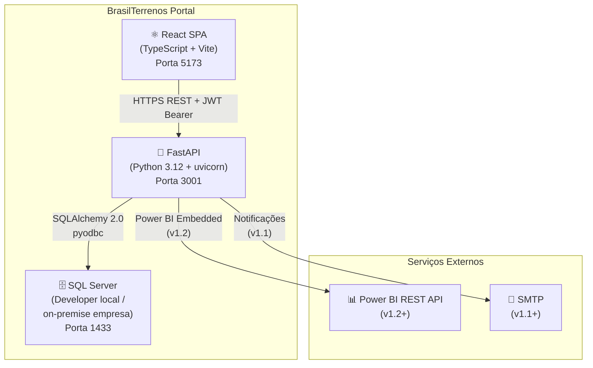
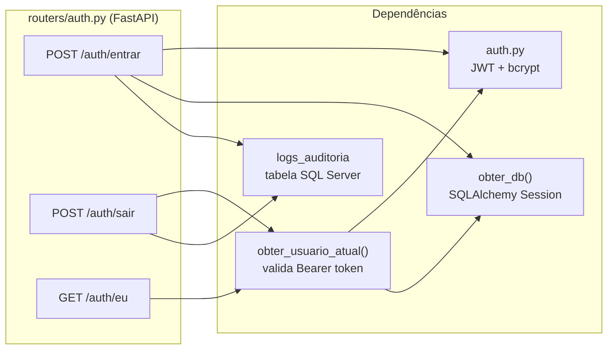
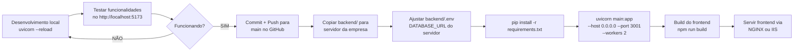

# Diagramas do Sistema

> **Documento:** 06-arquitetura/03-diagramas.md  
> **Status:** Vigente  
> **Criado em:** Maio/2026  
> **Atualizado em:** Maio/2026

> **Nota:** Os diagramas abaixo estão em formato texto/ASCII para edição e versão em repositório. Para visualização gráfica, recomenda-se importar as descrições no **draw.io**, **Mermaid Live Editor** ou **PlantUML**.

---

## 1. Diagrama de Contexto (C4 — Nível 1)



---

## 2. Diagrama de Containers (C4 — Nível 2)



---

## 3. Diagrama de Componentes — Módulo Auth (C4 — Nível 3)



---

## 4. Diagrama de Sequência — Autenticação

```
Browser              FastAPI API           SQL Server
                     (uvicorn)

  │  POST /api/v1/auth/entrar  │                │
  │  { email, senha }          │                │
  │───────────────────────────▶│                │
  │                             │── SELECT usuario WHERE email=? ──▶│
  │                             │◀── usuario ────────────────────────│
  │                             │── bcrypt.verify(senha, hash_senha) │
  │                             │── verificar status != bloqueado    │
  │                             │── criar_token_acesso(sub=id)       │
  │                             │── UPDATE usuario SET ultimo_login  ──▶│
  │                             │── INSERT logs_auditoria ─────────────▶│
  │◀── 200 { token_acesso, tipo_token, perfil, nome } + Set-Cookie refresh_token │
  │                             │                │
  │  [Frontend: AuthContext guarda token_acesso em memória]
```

---

## 5. Diagrama de Sequência — Requisição Autenticada

```
Browser (Axios)      FastAPI API           SQL Server
                     (uvicorn)

  │  GET /api/v1/workspaces       │                │
  │  Authorization: Bearer <token> │                │
  │───────────────────────────────▶│                │
  │                                │── decodificar_token(token)      │
  │                                │── SELECT usuario WHERE id=sub ──▶│
  │                                │◀── usuario ────────────────────│
  │                                │── verificar usuario.status     │
  │                                │── [Depends(exigir_perfil(...))]│
  │                                │── SELECT espacos_trabalho ─────▶│
  │                                │◀── lista ──────────────────────│
  │◀── 200 [ { id, nome, ... } ] ──│                │
```

---

## 6. Diagrama de Sequência — Logout

```
Browser              FastAPI API           SQL Server

  │  POST /api/v1/auth/sair       │                │
  │  Authorization: Bearer <token> │                │
  │───────────────────────────────▶│                │
  │                                │── obter_usuario_atual()         │
  │                                │── INSERT logs_auditoria ────────▶│
  │◀── 200 { "mensagem": "Sessão encerrada" }       │
  │                                │                │
  │  [Frontend: AuthContext limpa token_acesso da memória]
  │  [Frontend: navegar('/login')]
```

---

## 7. Fluxo de Deploy (Desenvolvimento → Produção)



---

## 8. Diagrama de Casos de Uso Simplificado

```
┌──────────────────────────────────────────────────────────┐
│                    PORTAL BRASILTERRENOS                 │
│                                                          │
│  ┌─────────────────────────────────────────────────────┐ │
│  │ MÓDULOS DE CONSUMO                                  │ │
│  │  ○ Login / Logout         Todos os usuários ────────┼─┤
│  │  ○ Visualizar relatórios  Operador+ ────────────────┼─┤
│  │  ○ Navegar workspaces     Operador+ ────────────────┼─┤
│  │  ○ Gerenciar favoritos    Operador+ ────────────────┼─┤
│  └─────────────────────────────────────────────────────┘ │
│                                                          │
│  ┌─────────────────────────────────────────────────────┐ │
│  │ MÓDULOS ADMINISTRATIVOS                             │ │
│  │  ○ Gerenciar usuários     Administrador+ ───────────┼─┤
│  │  ○ Gerenciar permissões   Administrador+ ───────────┼─┤
│  │  ○ Gerenciar workspaces   Administrador+ ───────────┼─┤
│  │  ○ Configurar expediente  Administrador+ ───────────┼─┤
│  │  ○ Consultar logs         Gerente+ ─────────────────┼─┤
│  │  ○ Configurações do PBI   Super Administrador ──────┼─┤
│  └─────────────────────────────────────────────────────┘ │
└──────────────────────────────────────────────────────────┘
```

---

## Ferramentas Recomendadas para Diagramas

| Ferramenta | Uso |
|------------|-----|
| Mermaid Live | Diagramas de fluxo e sequência inline |
| draw.io / diagrams.net | Diagramas C4, arquitetura |
| PlantUML | Diagramas UML textuais |
| Excalidraw | Diagramas informais e whiteboards |

---

## Histórico de Alterações

| Versão | Data | Autor | Descrição |
|--------|------|-------|-----------|
| 1.0 | Maio/2026 | — | Criação inicial do documento (stack NestJS) |
| 2.0 | Maio/2026 | — | Reescrita completa: migração para FastAPI, SQL Server, remoção de Redis e BullMQ, nomes em Português, novos diagramas de sequência |
